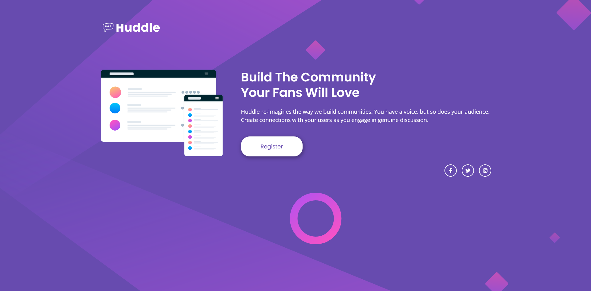

# Frontend Mentor - Huddle landing page with single introductory section solution

This is a solution to the [Huddle landing page with single introductory section challenge on Frontend Mentor](https://www.frontendmentor.io/challenges/huddle-landing-page-with-a-single-introductory-section-B_2Wvxgi0). Frontend Mentor challenges help you improve your coding skills by building realistic projects. 

## Table of contents

- [Overview](#overview)
  - [The challenge](#the-challenge)
  - [Screenshot](#screenshot)
  - [Links](#links)
- [My process](#my-process)
  - [Built with](#built-with)
  - [What I learned](#what-i-learned)
- [Author](#author)

**Note: Delete this note and update the table of contents based on what sections you keep.**

## Overview

This is a landing page built with HTML and CSS. It is built mobile first and flexbox for the layout. It has some hover effects and a little bit of animations.

### The challenge

Users should be able to:

- View the optimal layout for the page depending on their device's screen size
- See hover states for all interactive elements on the page

### Screenshot



### Links

- Solution URL: [https://www.frontendmentor.io/solutions/responsive-huddle-landing-page-using-html-and-css-4BNaHxnjy1](https://www.frontendmentor.io/solutions/responsive-huddle-landing-page-using-html-and-css-4BNaHxnjy1)
- Live Site URL: [https://schindlerdumagat.github.io/huddle-landing-page/](https://schindlerdumagat.github.io/huddle-landing-page/)

## My process

1. Create a github repository for the project.
2. Inspect the figma design to view the whole design. Check the colors, fonts and spacings that are needed. Also, checked for the states of the page that is needed to be implemented.
3. Built the HTML structure according to the design.
4. Write the CSS starting with the CSS resets, reusable custom variables and implement the major and minor layout.
5. Refactor the code.
6. Push it to github and make it live.

### Built with

- Semantic HTML5 markup
- CSS custom properties
- Flexbox
- Mobile-first workflow
- BEM

### What I learned

I was able to reinforce my knowledge with HTMl and CSS. Learned new accessibility techniques like using aria-hidden and role as presentation. Learned how to implement animations using keyframes and used Copilot AI companion to improve my code even more.

```html

```

```css
@keyframes fadeIn {
  from { opacity: 0; transform: translateY(20px); }
  to { opacity: 1; transform: translateY(0); }
}

.content-container {
  animation: fadeIn 800ms ease-out;
}
```

## Author

- Website - [Schindler Dumagat](https://schindlerdumagat.github.io/webportfolio/)
- Frontend Mentor - [@schindlerdumagat](https://www.frontendmentor.io/profile/schindlerdumagat)
- LinkedIn - [@schindler-linkedin](https://www.linkedin.com/in/schindler-dumagat-015238230/)
